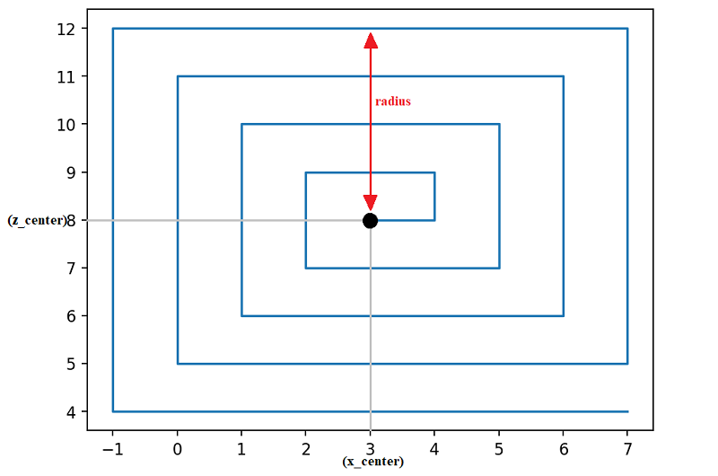

# mcloady

mcloady is a lightweight python script used to pre-generate Minecraft terrain (or generate a part of an existant map) using MCRcon and carpet mod (optional). Inspired by [Pre-Generating A Minecraft World (Hermitcraft Season Seven) by Xisumavoid](https://www.youtube.com/watch?v=eA35S2GW-jI).

**Has this ever happened to you?** You are about to open your Minecraft server to the public but you need to pre-generate the terrain to avoid any lag issues when 20 people connect all at the same time to the server and start travelling in different directions. You would love to use pre-generating mods such as Chunky but they're not available for the version of Minecraft you want to play yet!

Fear no more, you don't need a dedicated Minecraft mod for it, just a player in a world, flying and looking around.

## Usage
Download the python file (you will need to have python 3 installed on your machine) or the compiled exe file from the releases. Fill in the config.ini file (see the **Configuration parameters** section bellow).

If you have carpet installed on your server you do not need to spawn a player. If you don't have carpet in your server, you need to spawn a player and leave it logged on in the world.

Make sure that RCON is enabled in your server.properties file by setting these parameters:

```
rcon.port=25575
enable-rcon=true
rcon.password=setyourownpassword
```

The RCON port 25575 is the default port and may be different, depending of the constraints of your server.
Make sure that the RCON port is open for your server, you may need to ask for it to your server provider. 

Once that is done you can execute the script and leave it running until it finishes. You can stop it at any time and continue afterwards, the script will remember where it stopped and continue from there.

## How does it work
The script uses a player for loading areas in the world. It puts the player into spectator mode, then moves the player in a spiral. 


You can use carpet mod if you don't want to have a Minecraft client open.

If stopped at any time and started again, it will start from the last saved position (which it does automatically).

Depending on the area you want to load and the time increments you're using, it can take a long time to pregenerate it. An area of 10000x10000 will take around 17 hours with the default parameters in the configuration file. If you want to reduce the time and your server can handle loading the terrain in less time than specified in the configuration file, you can lower the 'first_wait' and 'second_wait' parameters to make it shorter.

## Configuration parameters
| Parameter   | Description|
|-------------|-----------------------|
| server_ip   | This is your server IP	|
| password    | The password you've set in rcon.password in your server.properties file	|
| port | The RCON port, 25575 by default. May be different, depending of the constraints of your server |
| name        | The player name you want to use. If you're not using carpet, that has to be your player and it must be logged on	|
| use_carpet  | In case carpet is available and you don't want to spawn your player into the world, you can use carpet to spawn a bot for you so you don't need to have the Minecraft client open.	|
| last_tp     | This is the name of the file where the last teleport will be saved in case the program is interrupted. If it is interrupted it will start again from where it last stopped. It is saved in node format, not Minecraft coordinates.	|
| x_center      | The x-coordinate of the center of the generated terrain. Set this value if your spawn point is not at 0, 0	|
| z_center      | The z-coordinate of the center of the generated terrain. Set this value if your spawn point is not at 0, 0	|
| radius      | This is the radius (from the center of coordinates) of the square terrain that you would like to generate.	|
| altitude    | this parameter controls at what altitude will the player teleport.	|
| increments  | The increments in which the teleports will occur. For a render distance of 12 chunks (196 blocks), an increment of 200 is good. For render distance of 10 chunks, you can set it to increments of 150. |
| first_wait  | When the first teleport to a new part of the world occurs, the program will wait this time until starting to turn the player around.	|
| second_wait | After the first turn of the player has occurred, the program will wait this time to turn the player around.	|

## Usage in singleplayer
To use in singleplayer you can set up a minecraft server on your computer. Set the ip to "0.0.0.0" and configure the rest of the parameters as if you were to use it in a server. There is no need to open any ports. If you don't want to set up a server, you can use [mcloady_singleplayer](https://github.com/rubennp91/mcloady_singleplayer).

## Dependencies
Python dependencies:
- [mcrcon](https://pypi.org/project/mcrcon/) (required), a python library that implements the rcon communication protocol
- [configparser](https://docs.python.org/3/library/configparser.html) (required), a python library that implements a basic configuration language

Minecraft dependencies:
- [carpet mod](https://github.com/gnembon/fabric-carpet/wiki) (optional), used in this context to spawn a bot into a world

## Improving execution time and resource usage
If carpet mod is available for the version you want to pregenerate, I strongly suggest you use it. This way you don't need to have a minecraft client open and a player logged on. Using carpet is also good to prevent connection issues, if your Minecraft player disconnects the program will fail.

The script uses next to none resources of your computer. I suggest running it on a raspberry pi or similar if you have one available. I ran this script for a server with a raspberry pi 0w with no problems.

## Contributing
Pull requests are welcome.

## License
[MIT](https://choosealicense.com/licenses/mit/)
